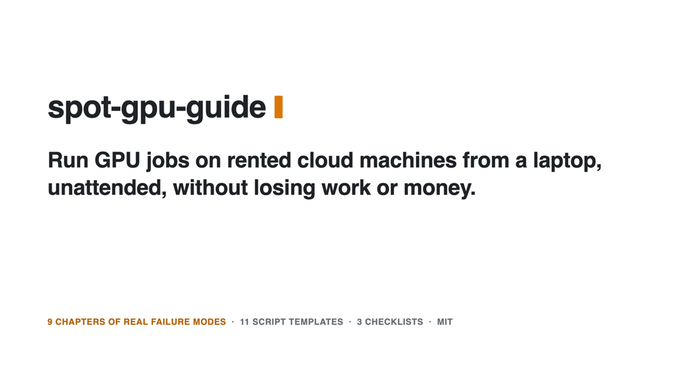

<h1 align="center">spot-gpu-guide</h1>

<p align="center"><b>A field guide and script templates for running training, eval and inference jobs on rented GPUs from a laptop, unattended, without losing work or money.</b></p>

<p align="center">Bash + Python 3 + gcloud. GCP worked example; AWS and SkyPilot rules included. No service, no account beyond your cloud's.</p>

<p align="center">
  
  
  
</p>

<p align="center"></p>

## Use it

| You want | Do this |
|---|---|
| The rules | Read [GUIDE.md](GUIDE.md), chapters 1–9 |
| The scripts in your project | `cp -r templates/ <your-project>/cloud/` and fill the placeholder block at the top of each file |
| The checks | Work through [checklists/](checklists/): preflight, launch, retire |

Start with [checklists/preflight.md](checklists/preflight.md) on day one: GPU quota requests can take days. Then copy the templates into your project. Each script opens with a marked placeholder block (project, bucket, VM prefix, zones, rates). The shell scripts and `spend.py` refuse to run while a placeholder is unfilled. Run a tier-0 plumbing pass before any real tier:

```bash
templates/detach.sh logs/run_tier0.pid bash -c 'templates/run_tier.sh 0 <CAP_USD> "--limit 20" >> logs/run_tier0.log 2>&1'
templates/watch.sh 0          # follow launcher + VM job log
python3 templates/spend.py    # one line per VM life + TOTAL
```

The VM deletes itself when the job ends, fails or is preempted. The launcher relaunches until the bucket shows `ALL_DONE`, `STOP` or `ERROR`, or spend hits the cap.

## Why

You rent one spot GPU because the quota allows one. It gets preempted mid-run. Your laptop crashes overnight and every watcher dies with it. A progress bar kills your eval through a 64 KB line limit you never heard of. Each of these happens in real runs, and each one is a rule in this guide with the fix that works.

This repo is those rules plus the scripts that encode them: an idempotent VM job script, a local relaunch loop with a USD cap, a spend estimator from the operations log, a log follower, a detacher that survives session teardown, and a launchd agent that survives a reboot.

**Use something else if** you want a managed layer instead of scripts you own. [SkyPilot](https://github.com/skypilot-org/skypilot) handles multi-cloud spot launch, recovery and cost comparison, and wins when you use more than one provider. [dstack](https://github.com/dstackai/dstack) wins when you want a declarative config over a fleet. [Modal](https://modal.com) wins when you accept a hosted runtime to avoid VMs entirely. This guide wins when you run one GPU on one cloud and want every failure mode visible in about 420 lines of shell and Python.

## What the guide covers

1. Account, quota, billing: the 1-GPU reality, scoped identities with tag-gated teardown, AWS spot quota, price is not capacity, a region's network preflight, budgets that only email, prices from the catalog.
2. A job that survives spot: bucket-held state, `DONE` markers, self-deleting VMs, `git archive HEAD`, the short preemption notice, checkpoint and adapter protocols, batch jobs with per-unit resume, artifacts mirrored as they form.
3. Startup-script and VM gotchas: no `HOME`, the 64 KB line limit, buffered stdout, CPython shutdown crashes, falsy `0`, silent gating steps, build and mirror failures.
4. Supervision: two tiers, reading the boot, watchdog requirements, a nightwatch with a hard deadline, detaching and surviving reboots, one supervisor per scope.
5. Serverless GPU endpoints: billing is uptime, the two-process proxy, cached reads and a closed-port zero-spend proof, one driver per window.
6. The laptop: disk, one local GPU job at a time, crash forensics, environment gotchas.
7. Planning a run: decision metric first, eval headroom, early-stop rules, one row per VM life.
8. Reference numbers: prices, cold starts, throughput.
9. Orchestrators (SkyPilot): API-server identity, detached runs, autostop and jobs, tags, the shared controller.

## Templates

```text
templates/job.sh                  # VM startup script: data -> stages -> eval -> gate; ERROR marker; self-delete
templates/run_tier.sh             # local relaunch loop: clean-tree check, code upload, USD cap, max launches
templates/spend.py                # spend estimate from the GCP operations log x catalog rate
templates/watch.sh                # follow the launcher log + newest VM job log from the bucket
templates/detach.sh               # setsid + double fork: survive agent session teardown
templates/swap_vm_after_marker.sh # replace the running VM once a bucket marker appears (new code/eval order)
templates/supervisor.plist        # launchd agent (RunAtLoad + KeepAlive) for the tier-2 supervisor
templates/batch_job.sh            # VM startup script for a one-shot eval/sweep: fixed campaign path, per-unit resume, ready line, DONE
templates/relaunch.sh             # env-file relaunch loop for any startup script: DONE/ERROR markers, zone rotation, life + USD caps
templates/job.env.example         # config for relaunch.sh
templates/launcher.plist          # launchd agent for the relaunch loop itself (survives a reboot)
```

The templates are generalised from scripts that ran real jobs, with project names replaced by placeholders. The gotcha comments are kept inline.

## Verify it yourself

```bash
for f in templates/*.sh; do bash -n "$f"; done      # syntax
python3 -m py_compile templates/spend.py            # syntax
bash templates/run_tier.sh 0 1; echo $?             # placeholder guard: refuses, exit 1
bash templates/relaunch.sh templates/job.env.example; echo $?   # placeholder guard: refuses, exit 1
plutil -lint templates/supervisor.plist templates/launcher.plist   # macOS plist syntax
```

These checks cover syntax and the placeholder guards only. The generalised templates have not yet run on a VM as such; their originals ran staged training, a multi-hour batch eval under launchd with a real relaunch, and exited on their `DONE` markers. The fail-safe paths added since (unknown spend launches nothing, a failed listing skips the round, only a capacity error moves to the next zone, a preemption never writes `ERROR`) are syntax-checked only. A filled-in plumbing pass on a new project is the open verification item.

## License

MIT. See [LICENSE](LICENSE).

[GUIDE.md](GUIDE.md) · [checklists/](checklists/) · [templates/](templates/) · [launch video](marketing/launch.mp4)

[GUIDE.md](GUIDE.md) · [checklists/](checklists/)
